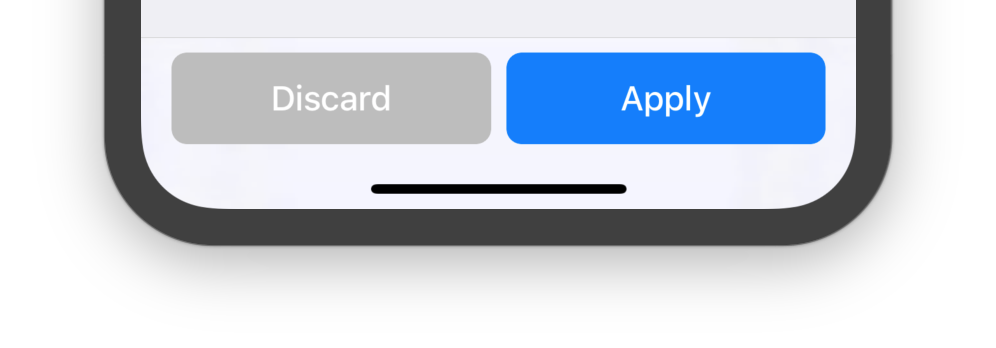

# MKDActionBarNavigationController

A `UINavigationController` subclass that supports hosting custom action buttons at the bottom of the device screen.

## Usage

Please copy all source files from the `MKDActionBarNavigationController` folder into your project. To supply custom `UIButton` subclasses, just subclass `MKDActionBarNavigationController` itself.

View Controller that support action buttons should implement the `MKDActionButtonHosting` protocol.

## License

Everything in this project is licensed under the [MIT license](http://opensource.org/licenses/MIT).
